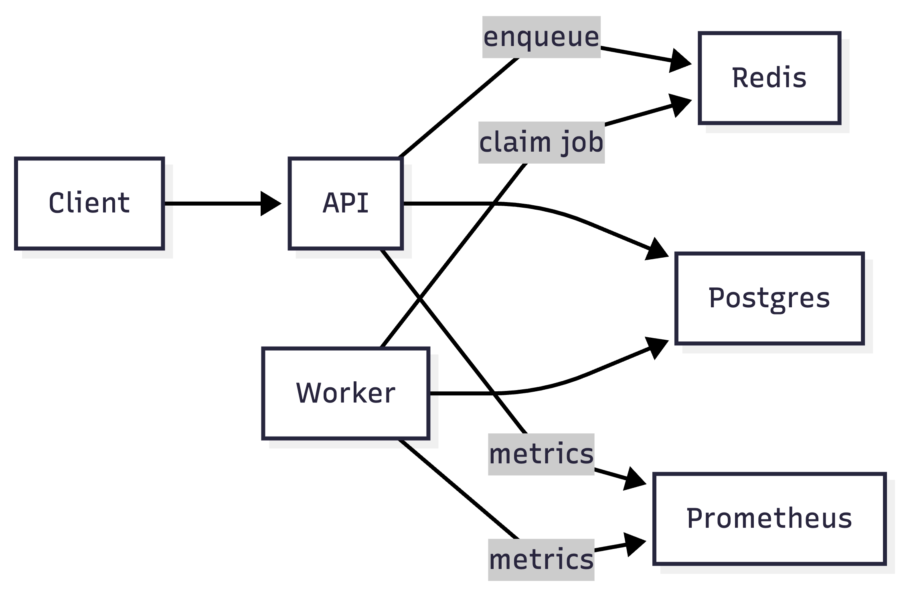

# Faultline — Production-Grade Distributed Job Processing System

Faultline is a PostgreSQL-backed distributed job processing system designed for **correctness under failure**.
It uses PostgreSQL as the **source of truth and coordination layer**, with **lease-based execution** and
**row-level locking** (`FOR UPDATE SKIP LOCKED`) to provide crash-safe recovery and **at-least-once execution semantics**.

## Why This Exists

Many job queues demonstrate that jobs can run once.
Faultline is designed to demonstrate that jobs remain **correct, recoverable and observable** under real failure conditions, including:

- Worker crashes during execution  
- Duplicate job submissions (idempotency)  
- Database outages followed by recovery  

## Architecture



Faultline uses PostgreSQL as the coordination layer and source of truth.

Workers atomically claim jobs by acquiring **time-bound leases** on job rows.
If a worker crashes mid-execution, the lease expires and another worker safely recovers the job.

## Core Design & Guarantees

Faultline provides the following guarantees:

- **Durable job state machine**  
  Jobs transition through explicit states: `queued → running → succeeded | failed`.

- **Lease-based execution**  
  Workers must hold a valid lease (`lease_owner`, `lease_expires_at`) to execute a job.

- **Crash-safe recovery**  
  Jobs with expired leases automatically become eligible for reprocessing.

- **Database-enforced idempotency**  
  Idempotency keys are enforced at the database level to prevent duplicate side effects.

- **Bounded retries with backoff**  
  Jobs retry using exponential backoff (`next_run_at`) and transition to a terminal failed state after `max_attempts`.

- **Explicit failure visibility**  
  Failures are surfaced through metrics rather than hidden retries.

## Observability

Faultline exposes Prometheus metrics for both the API and worker processes, including:

- Job throughput and execution latency  
- Retry counts and failure rates  
- Lease expirations and recovery events  
- Queue depth and backlog growth  

This makes failure modes and performance bottlenecks visible rather than implicit.

## Failure Validation

Faultline includes scripted failure drills that validate system behavior under:

- Worker termination during job execution  
- Repeated job failures triggering retries  
- Lease expiration and recovery by other workers  

These drills demonstrate that the system recovers without manual intervention.

## Correctness Guarantees (Retry-Safe Ledger Semantics)

**Schema-backed invariant:** Each job may produce at most one ledger entry (`ledger_entries.job_id UNIQUE`), enforcing idempotent application at the database boundary.

Faultline is designed to behave predictably under retries, partial failures, and worker crashes by enforcing correctness at the database boundary.

### Guarantees
- **Idempotent effects:** Each transaction/job is applied **at most once** using an idempotency key (`transaction_id`) and database uniqueness constraints.
- **Atomic visibility:** Applying an effect and recording its ledger entry happens in a **single database transaction**, preventing partial state from becoming visible.
- **Ordered state transitions:** Jobs/transactions follow a strict lifecycle (e.g., `INIT → APPLIED → RECONCILED` or `INIT → FAILED`). Illegal transitions are rejected.
- **Crash-safe recovery:** A periodic **reconciliation job** repairs incomplete state after crashes by ensuring ledger state and transaction state converge.

### Supported Failure Scenarios
- Worker crash mid-apply
- Duplicate retries / duplicate submissions
- Out-of-order retries
- Partial writes (repaired by reconciliation)

### Invariants (informal)
- No duplicate ledger entries for the same `transaction_id`
- A transaction marked `APPLIED` must have a corresponding ledger entry
- Reconciliation eventually converges `INIT` transactions to the correct terminal state

## Tech Stack

- Python  
- PostgreSQL  
- Docker  
- Prometheus  

## Quickstart

```bash
docker compose up -d --build
make migrate
curl http://localhost:8000/health

