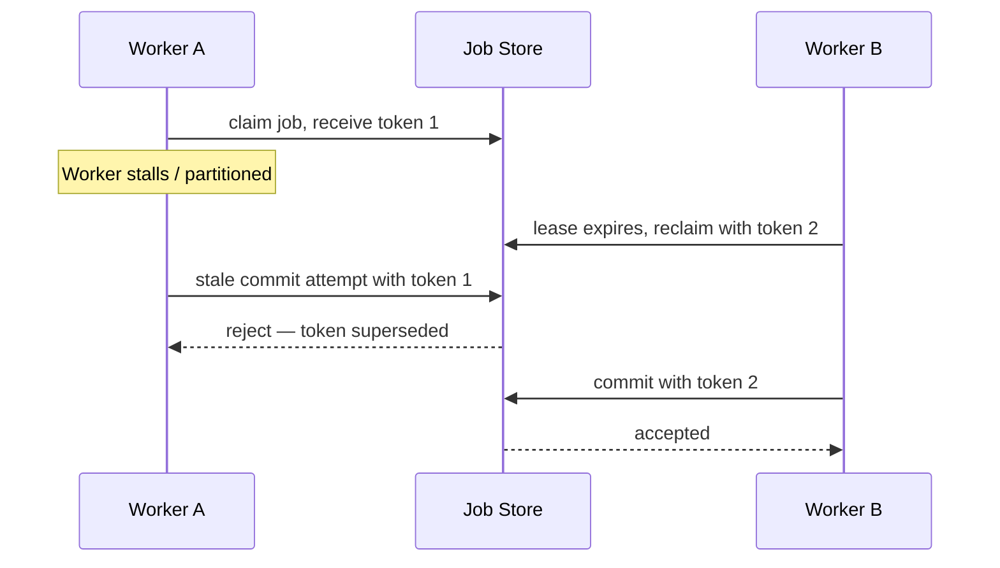

# Faultline

Faultline proves that distributed job recovery is only safe when stale workers are fenced, duplicate commits stay zero, and ownership remains correct under failure.

**Core idea:** Recovery is not availability returning. Recovery is state remaining correct.

**Proof:** 12 scenarios tested · 4 fault profiles injected · 0 duplicate commits across all recovery runs · JSON and Markdown reports generated · fencing invariant enforced under partition, stall, and crash

---

Faultline is not about running jobs.
It is about proving recovery correctness under stale ownership.

---

## The Failure Mode

A worker claims a job and receives a fencing token. It stalls — due to a slow network, GC pause, or partition. The lease expires. A second worker reclaims the job with a new token and begins executing. The first worker wakes up and attempts to commit with its old token.

If the system accepts that commit, the job state is now corrupt: two workers believe they own the result, one of them is wrong, and there is no record of which.

This is not a rare edge case. It is the standard partial-failure scenario in any distributed queue, workflow engine, or task processor.

---

## The Invariant

Only the worker holding the current fencing token may commit job state. Any write carrying a superseded token must be rejected, logged, and attributed to a stale writer.

---

## Architecture


```mermaid
sequenceDiagram
    participant W1 as Worker A
    participant DB as Job Store
    participant W2 as Worker B

    W1->>DB: claim job, receive token 1
    Note over W1: Worker stalls / partitioned
    W2->>DB: lease expires, reclaim with token 2
    W1->>DB: stale commit attempt with token 1
    DB-->>W1: reject — token superseded
    W2->>DB: commit with token 2
    DB-->>W2: accepted
```

---

## What Faultline Proves

| Claim | Evidence |
|---|---|
| Stale workers cannot commit after lease takeover | correctness audit across all fault scenarios |
| Duplicate commits remain zero | recovery report |
| Network partitions do not silently corrupt state | partition fault profile |
| Crash recovery restores correct ownership | crash fault profile |
| Recovery timeline is fully explainable | timeline report per scenario |

---

## Fault Profiles Injected

| Fault Type | Scenario |
|---|---|
| Worker stall | lease expires while worker is processing |
| Network partition | worker loses connectivity mid-execution |
| Crash before commit | worker dies without writing result |
| Crash after partial write | worker dies after writing partial state |

---

## Evidence Structure

```
reports/
  correctness-audit.json      # per-scenario token validation results
  recovery-report.json        # duplicate commit count, ownership trace
  timeline-report.md          # human-readable recovery timeline
  fault-profiles/             # per-fault-type injection and outcome logs
```

---

## Run Locally

```bash
git clone https://github.com/kritibehl/faultline
cd faultline
# see README for dependency setup
make test
make fault-inject
make report
```

---

## Limits and Next Steps

- Current implementation uses a single job store; multi-region replication adds fencing complexity not yet modeled
- Token generation is monotonic but not globally ordered across shards
- Does not yet model Byzantine workers (only crash-stop and stall failures)

---

> [!IMPORTANT]
> Recovery correctness is not the same as service availability. A system can return to "available" while job state is corrupt. Faultline tests for correctness, not uptime.

---

[github.com/kritibehl/faultline](https://github.com/kritibehl/faultline)
