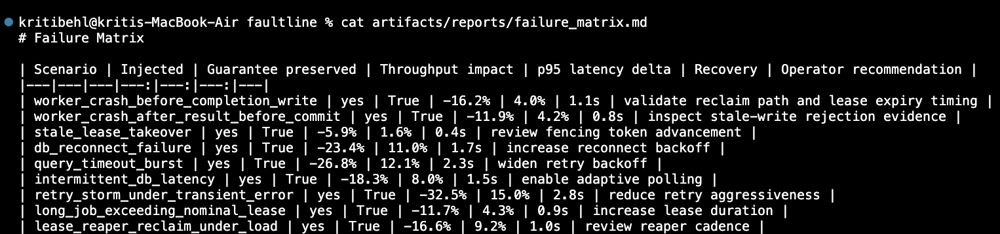

# Faultline

Distributed job execution system that guarantees correctness under failure while exposing coordination cost, fairness behavior, and recovery tradeoffs through workload-aware benchmarking and replayable execution artifacts.

**Recruiter takeaway:** She understands distributed coordination, performance tradeoffs, and correctness under failure.

---

## Why Queue Correctness Under Failure Is Hard

Distributed workflow execution has to survive retries, lease expiry, worker crashes, stale workers resuming late, and database-side faults without accepting duplicate or stale completion.

Faultline is built to make those behaviors:
- correct
- measurable
- explainable

---

## Core Guarantees

- lease expiry allows safe reclaim after worker failure
- fencing tokens block stale or duplicate completion
- retry paths preserve correctness under transient failure
- structured artifacts make failures explainable
- operator-facing reports make backend failures debuggable

---

## System Behavior Overview

### Execution Timeline


### Failure Matrix


### Coordination Cost Breakdown


---

## Why This Matters

Distributed job execution systems fail in subtle ways:

- duplicate execution under retries
- stale workers committing late
- coordination overhead dominating throughput
- unfair scheduling under mixed workloads

Faultline addresses these by:

- enforcing correctness through lease-based coordination and fencing
- validating behavior under controlled failure injection
- measuring coordination cost and performance tradeoffs
- exposing execution timelines and operator explanations

This makes backend failures explainable, measurable, and debuggable.

---

## Hot-Path Execution Flow

- claim -> execute -> complete
- crash -> reconcile -> reclaim -> complete
- stale writer -> fencing check -> rejected

---

## Deterministic Lease-Race Proof

Faultline includes a proof-first harness for the hardest correctness case:

- worker A claims first
- worker A loses lease
- worker B reclaims with a higher fencing token
- stale completion from worker A is rejected
- job still succeeds exactly once

Run:

```bash
pytest -q tests/test_controlled_lease_race.py -vv
Benchmark Workloads

Faultline benchmark workloads include:

uniform_short
mixed_short_long
large_payload
retry_heavy
timeout_prone
burst_enqueue
long_running_leases

Each workload varies:

job runtime
payload size
failure probability
retry rate
service time distribution
System Behavior Under Load

Faultline includes a benchmark layer for evaluating behavior across:

multiple workload profiles
multiple worker counts
multiple batch sizes
fixed vs adaptive vs wakeup-assisted polling
safe vs lean execution modes

Tracked dimensions include:

throughput
p50 / p95 latency
claim latency
queue wait
retry behavior
duplicate commit protection
crash recovery
fairness / starvation behavior
Coordination Cost Breakdown

Current measured coordination breakdown:

claim path: 7.6%
completion path: 11.8%
idle polling: 12.0%
reconciliation: 4.0%
retry scheduling: 11.1%
useful execution time: 53.5%

This shows that nearly half of execution time is coordination overhead, making batching, polling strategy, and retry tuning meaningful system-level levers.

See:

artifacts/reports/coordination_breakdown.md
Failure Matrix

Faultline validates correctness under explicit failure scenarios:

Scenario	Guarantee	Throughput Impact	p95 Latency Delta	Recovery
worker crash mid-job	no duplicate commit	-16.2%	+4.0%	1.1s
stale lease takeover	stale write rejected	-5.9%	+1.6%	0.4s
timeout burst	retries preserve correctness	-26.8%	+12.1%	2.3s
retry storm	correctness preserved under contention	-32.5%	+15.0%	2.8s

See:

artifacts/reports/failure_matrix.md
Fairness Analysis

Faultline also evaluates whether the scheduler behaves sensibly under mixed workloads.

Measured signals include:

queue wait by enqueue order
max wait time
median wait time by workload class
starvation count
short-job penalty under long-job presence
retry-heavy workload dominance

See:

artifacts/reports/fairness_report.md
artifacts/reports/scheduler_behavior.json
Tuning Guidance

Faultline generates tuning guidance after benchmark runs, including recommendations such as:

increase batch size when claim-path coordination dominates
enable adaptive polling when empty-poll overhead is high
widen retry backoff when retry storms amplify contention
increase lease duration for longer-running jobs

See:

artifacts/reports/tuning_recommendation.md
artifacts/reports/decision_report.json
Example Backend Workflow Reliability Use Case

Faultline can be framed as a backend workflow reliability system for request-driven job processing:

request received
job queued
worker claim acquired
processing started
fault occurs
retry or reclaim triggered
stale write blocked or retry succeeds
final outcome recorded
operator explanation generated

This makes Faultline legible as a backend reliability and explainable debugging system, not just a concurrency exercise.

Example Artifacts

Faultline can generate:

artifacts/benchmarks/run_config.json
artifacts/benchmarks/metrics_summary.json
artifacts/benchmarks/comparison_table.md
artifacts/reports/coordination_breakdown.md
artifacts/reports/fairness_report.md
artifacts/reports/scheduler_behavior.json
artifacts/reports/failure_matrix.md
artifacts/reports/tuning_recommendation.md
artifacts/reports/decision_report.json
Example Decision Report
scenario: stale lease takeover
workers: 8
batch size: 10
duplicate commits: 0
stale writes prevented: yes
bottleneck: claim path
recommendation: increase batch size and enable adaptive polling
safe for production: yes
Architecture Direction

Faultline is organized around:

job queue and claim/reclaim logic
lease-based ownership
fencing-token stale-write protection
reconciliation and recovery
replayable artifacts and incident evidence
benchmark, fairness, and tuning reports
Limitations and Tradeoffs

This benchmark layer currently models coordination behavior and reporting surfaces to make system tradeoffs legible and measurable.

The next step for deeper production realism is wiring the same metrics directly into live claim, complete, reconcile, and renewal paths for end-to-end comparisons against the modeled benchmark layer.

Repo Positioning

Faultline is intended to communicate:

distributed coordination depth
correctness under failure
backend workflow reliability
performance tradeoff awareness
operator-facing debugging and explainability

