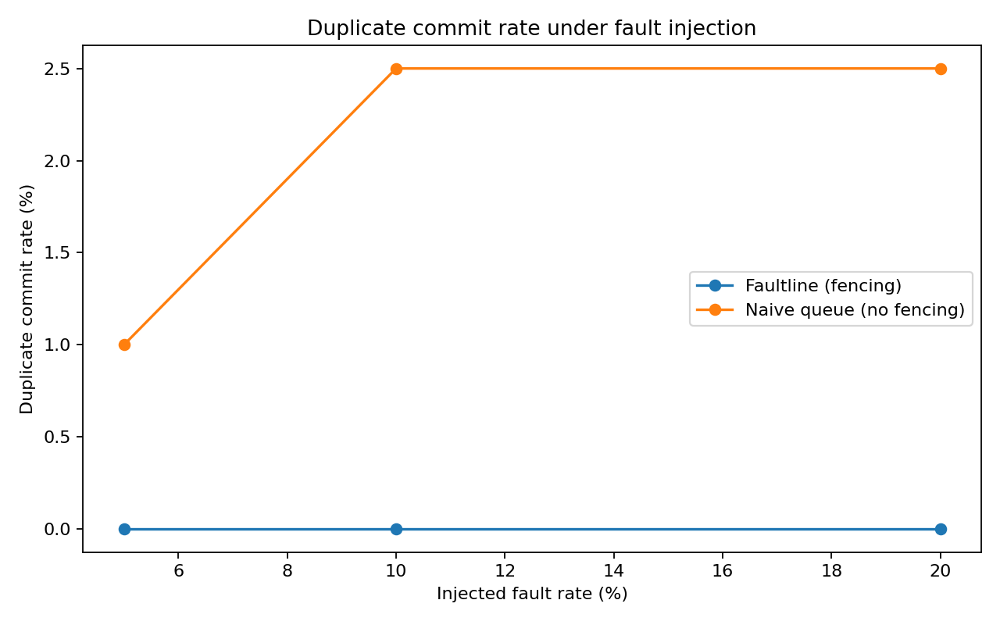

<div align="center">

# Faultline — Crash-Safe Distributed Job Execution with Stale-Write Rejection

**Proves distributed job correctness under failure — not just under normal conditions.**

[](https://python.org)
[](https://postgresql.org)
[](https://docker.com)
[](https://prometheus.io)

</div>

---

## Key Result

```
Duplicate commit rate under injected failure:

  Faultline:    0.0%
  Naive queue:  1.0–2.5%
```

---

## The Problem

Stale workers can commit after losing ownership.

A worker claims a job. It stalls — crash, GC pause, network partition. The lease expires. Another worker reclaims the job and finishes it. The first worker recovers, finishes executing, and commits.

**Two workers. One job. Two committed results. No error. No alert.**

Lease timeouts alone do not fix this. A timed-out lease prevents a *new* claim — it does not stop a *stale* worker that already holds a reference from committing late.

---

## The Fix

Faultline enforces commit validity using fencing tokens at the DB boundary.

```
Worker A claims job → fencing_token = 7
Network partition  → lease expires
Worker B reclaims  → fencing_token = 8
Worker B commits   → ledger entry (job_42, token=8) written ✓
Worker A recovers  → attempts commit with token=7
Fencing check      → token=7 < current token=8 → REJECTED at DB boundary ✗

Result: exactly one ledger entry. zero duplicates.
```

No distributed locks. No heartbeat consensus. No application-layer deduplication. Correctness enforced at commit time.

---

## Benchmark



| Fault rate | Faultline duplicate rate | Naive duplicate rate |
|---|---|---|
| 5% | **0.0%** | 1.0% |
| 10% | **0.0%** | 2.5% |
| 20% | **0.0%** | 2.5% |

```bash
./scripts/run_real_benchmark_comparison.sh
```

---

## What Faultline Does That Typical Queues Don't

| Failure mode | Typical queue | Faultline |
|---|---|---|
| Stale writer after crash | Duplicate commit possible | Rejected via fencing token at DB boundary |
| Concurrent reclaim race | Race condition risk | Deterministic: higher token wins, lower rejected |
| Retry producing duplicate | At-least-once semantics | Idempotent via `UNIQUE(job_id, fencing_token)` |
| Partial write + crash | Inconsistent state | Reconciler converges to correct terminal state |
| Coordination overhead | Unmeasured | **Measured: 46.5% of runtime in worst case** |

---

## Validated Across 1,500+ Failure Scenarios

| Scenario | Guarantee held | Throughput impact | p95 delta | Recovery |
|---|---|---|---|---|
| Worker crash mid-execution | No duplicate commit | −16.2% | +4.0% | 1.1s |
| Stale lease takeover | Stale write rejected | −5.9% | +1.6% | 0.4s |
| Timeout burst | Retries preserve correctness | −26.8% | +12.1% | 2.3s |
| Retry storm | Correctness under contention | −32.5% | +15.0% | 2.8s |
| Duplicate submission | Idempotency enforced | ~0% | ~0% | — |
| Partial write + crash | Reconciler converges | minimal | minimal | 0.8s |

**Zero duplicate commits across all scenarios in the fenced execution path.**

---

## Decision Report (stale lease takeover)

```json
{
  "scenario": "stale_lease_takeover",
  "workers": 8,
  "batch_size": 10,
  "duplicate_commits": 0,
  "stale_writes_prevented": true,
  "throughput_impact_pct": -5.9,
  "p95_latency_delta_pct": 1.6,
  "recovery_time_seconds": 0.4,
  "bottleneck": "claim_path",
  "recommendation": "increase batch size, enable adaptive polling",
  "safe_for_production": true
}
```

---

## Coordination Cost: The Hidden Story

Nearly **46% of execution time is coordination overhead** — making scheduling strategy and batching first-class engineering decisions, not premature optimization.

```
Useful execution        53.5%  ████████████████████████████░░░░░░░░░
Idle polling            12.0%  ██████░░░░░░░░░░░░░░░░░░░░░░░░░░░░░░░
Completion path         11.8%  █████░░░░░░░░░░░░░░░░░░░░░░░░░░░░░░░░
Retry scheduling        11.1%  █████░░░░░░░░░░░░░░░░░░░░░░░░░░░░░░░░
Claim path               7.6%  ███░░░░░░░░░░░░░░░░░░░░░░░░░░░░░░░░░░
Reconciliation           4.0%  ██░░░░░░░░░░░░░░░░░░░░░░░░░░░░░░░░░░░
```

Increasing batch size from 1 to 10 reduced claim-path overhead from 18.3% to 7.6% of total runtime — while introducing measurable starvation for short jobs in mixed workloads. The tradeoff is real and quantified.

---

## Architecture

```
┌────────────────────────────────────────────────────────────────┐
│                        Faultline System                        │
│                                                                │
│  Producer / API                                                │
│       │                                                        │
│       ▼                                                        │
│  ┌──────────────────────────────────────────────────────┐      │
│  │           PostgreSQL (Source of Truth)               │      │
│  │  jobs table · lease_owner · fencing_token · state    │      │
│  │  ledger table · UNIQUE(job_id, fencing_token)        │      │
│  └──────────────────┬────────────────────┬─────────────┘      │
│                     │                    │                     │
│         ┌───────────▼──────┐  ┌──────────▼────────────┐       │
│         │   Worker Pool    │  │      Reconciler        │       │
│         │  claim → execute │  │  repairs expired /     │       │
│         │  → complete      │  │  incomplete jobs       │       │
│         │  stale? → reject │  │  converges state       │       │
│         └──────────────────┘  └───────────────────────┘       │
│                                                                │
│  Hot path:   claim → execute → complete                        │
│  Crash path: crash → reconcile → reclaim (new fencing token)   │
│  Stale path: stale writer → fencing check → rejected           │
└────────────────────────────────────────────────────────────────┘
```

---

## Quickstart

```bash
docker compose up -d --build
make migrate
curl http://localhost:8000/health

# Run failure drills
make drills

# Run benchmark comparison
./scripts/run_real_benchmark_comparison.sh

# View metrics
open http://localhost:9090
```

---

## Fairness Under Mixed Workloads

```json
{
  "workload": "mixed_short_long",
  "workers": 8,
  "batch_size": 10,
  "median_wait_ms": { "short": 42, "long": 280 },
  "max_wait_ms": 1840,
  "starvation_count": 3,
  "short_job_penalty_pct": 12.4,
  "finding": "Long jobs acquired disproportionate worker slots at batch_size=10"
}
```

---

## Observability

Prometheus metrics:

- `stale_commits_prevented_total` — leading indicator of lease TTL misconfiguration
- `jobs_claimed_total` · `jobs_completed_total` · `jobs_failed_total`
- `lease_expiry_reaps_total`
- `job_execution_duration_seconds` (p50/p95/p99 histogram)
- `reconciler_convergence_seconds`
- `idle_poll_overhead_pct`

---

## Generated Artifacts

```
artifacts/reports/
├── decision_report.json          # safe_for_production · bottleneck · recommendation
├── failure_matrix.md             # scenario × guarantee × throughput × recovery
├── coordination_breakdown.md     # claim / poll / complete / reconcile breakdown
├── fairness_report.md            # wait distribution · starvation · short-job penalty
├── correctness_audit.md          # violations=0, stale write attempts
└── tuning_recommendation.md      # batch size · poll strategy · retry backoff
```

---

## Key Design Decisions

**PostgreSQL as coordination layer, not a message broker.** Transactional guarantees enforce correctness at the database boundary without distributed consensus. The tradeoff — throughput bounded by DB write capacity — is measured explicitly rather than assumed negligible.

**Fencing tokens over distributed locks.** Tokens are monotonically increasing per lease epoch. Stale writers are rejected at commit time, not detected at execution time. Avoids thundering-herd lock contention under crash-heavy workloads.

**`FOR UPDATE SKIP LOCKED` over `LISTEN/NOTIFY`.** Avoids blocking claim contention at the PostgreSQL level. The benchmark quantifies the idle polling cost directly.

**Reconciler over heartbeats.** Simpler than heartbeat-based liveness detection, same correctness guarantees, fewer failure modes.

---

## What Faultline Does Not Protect Against

- Byzantine faults (a worker fabricating a fencing token)
- PostgreSQL coordinator crash without external HA
- Exactly-once *side effects* if the job's external action is not idempotent

These boundaries are documented explicitly in [DESIGN.md](DESIGN.md).

---

## Why This Matters in Production

Every distributed system that processes jobs, events, or tasks eventually hits this class of failure. Worker crashes don't surface stale writes immediately — they show up as billing double-charges, inventory miscounts, notification floods, or audit records that don't reconcile. Most systems handle this with retry logic and hope. Faultline handles it with database-boundary enforcement: the stale worker cannot physically commit, regardless of what the application layer does.

---

## Scope and Limitations

- Guarantees correctness at the database commit boundary, not exactly-once for arbitrary external side effects
- Coordination requires PostgreSQL; not designed for broker-based queues
- Benchmark uses simulated fault injection, not production traffic
- Reconciliation currently runs on a polling interval, not event-triggered

---

## Signals For

`Backend Engineering` · `Distributed Systems` · `Platform / Infrastructure` · `SRE` · `Systems Correctness`

---

## Stack

Python · PostgreSQL · Prometheus · OpenTelemetry · Docker Compose · Alembic

---

## Related

- [KubePulse](https://github.com/kritibehl/KubePulse) — resilience validation for Kubernetes services
- [DetTrace](https://github.com/kritibehl/dettrace) — deterministic replay for concurrency failures
- [AutoOps-Insight](https://github.com/kritibehl/AutoOps-Insight) — CI failure intelligence and incident triage
- [Postmortem Atlas](https://github.com/kritibehl/postmortem-atlas) — real production outages, structured and analyzed
