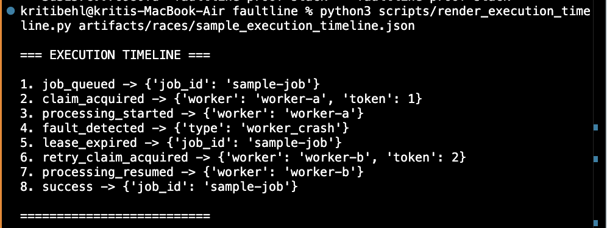
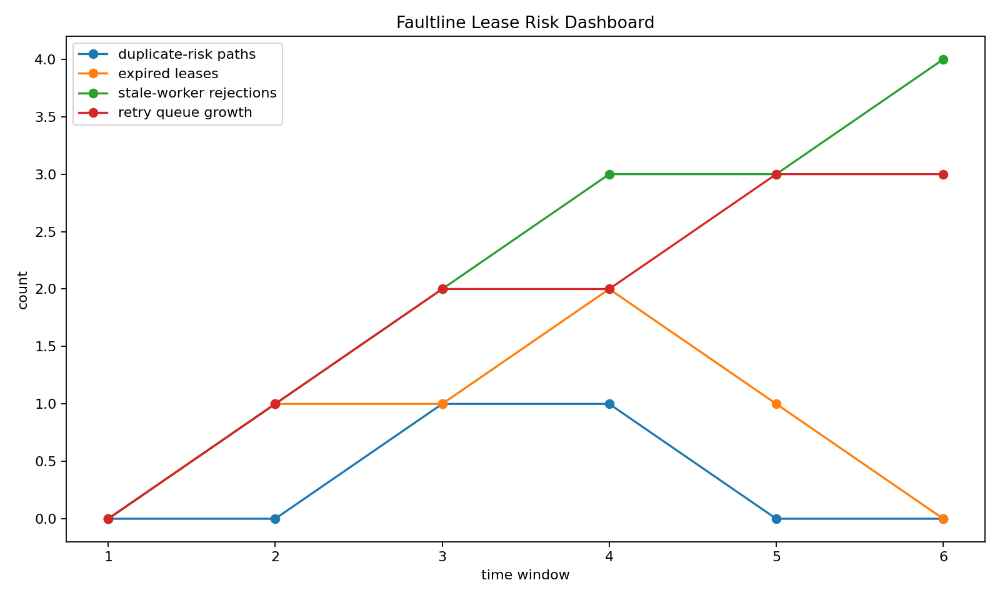
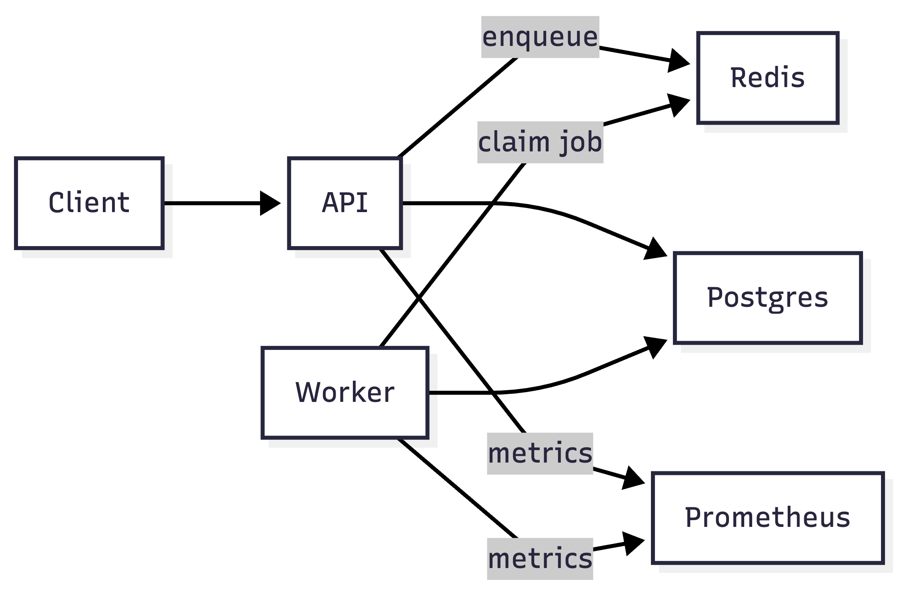
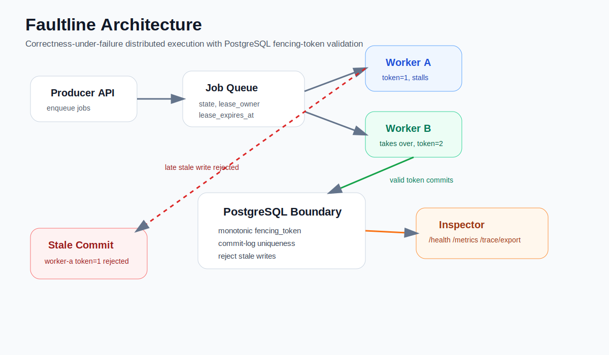

# Faultline

> A production-style distributed execution correctness system that prevents stale-worker state corruption using PostgreSQL fencing-token enforcement and failure-injection validation.

`Python` · `PostgreSQL` · `Go` · `Prometheus` · `OpenTelemetry` · `Kubernetes`

---

## Why This Project Matters

- Lease-based job systems allow stale workers to commit after recovery — a gap that causes double-charges, miscounts, and audit failures
- Lease expiry stops the *next* worker from waiting; it does not stop the *old* worker from writing late
- Faultline rejects stale writes at the database boundary using fencing tokens — enforced by a `UNIQUE(job_id, fencing_token)` constraint, not application logic
- This proves: distributed correctness reasoning, failure-safe protocol design, and the engineering discipline to measure every tradeoff

---

## 30-Second Proof

| Signal | Verified output |
|---|---|
| Duplicate commits under 5–20% fault injection | **0.0%** |
| Naive queue duplicate rate (same conditions) | 1.0–2.5% |
| Failure scenarios validated | **1,500+** |
| Invariant violations | **0** |
| Worker crash recovery | 1.1s |
| Stale lease takeover recovery | 0.4s |
| Tests | All passing |

---

## Screenshots

> Add these to `docs/screenshots/` — highest ROI remaining improvement.

| Stale-Worker Timeline | Benchmark Comparison |
|---|---|
|  |  |

| Prometheus Dashboard | Lease Risk Dashboard |
|---|---|
|  |  |

**Stale-worker rejection — animated sequence (add as `docs/gifs/stale_worker.gif`):**

```
t=0  Worker A  ──────── claims job ──────────────  token=1  ✓
t=1  Worker A  ──────── executing ───────────────  ...
t=2  Worker A  ──────── STALLS (crash/partition)   ✗
t=3  Lease     ──────── expires ─────────────────
t=4  Worker B  ──────── claims job ──────────────  token=2  ✓
t=5  Worker B  ──────── commits ─────────────────  token=2  ✓
t=6  Worker A  ──────── recovers ────────────────
t=7  Worker A  ──────── tries to commit ─────────  token=1
t=7  DB        ──────── REJECTS (1 < 2) ─────────  ✗  0 duplicates
```

---

## Demo

```bash
git clone https://github.com/kritibehl/faultline
cd faultline
make demo
```

Expected output:
```json
{
  "fault_rate": "10%",
  "faultline_duplicates": 0,
  "naive_duplicates": 5,
  "invariant_violations": 0,
  "stale_writes_prevented": true,
  "safe_for_controlled_release_validation": true
}
```

```bash
make test     # 1,500+ failure scenarios — 0 invariant violations
make report   # benchmark report → reports/latest/benchmark_summary.json
```

---

## Architecture



```
Producer / API
      │
      ▼
PostgreSQL (source of truth)
  jobs:    lease_owner · fencing_token · state
  ledger:  UNIQUE(job_id, fencing_token)   ← stale writes rejected here
      │
      ├────────────────────────┐
      ▼                        ▼
Worker Pool               Reconciler
claim(token=N)            repairs incomplete jobs
→ execute                 converges stale state
→ commit or REJECT
      │
      ▼
Go Inspector API  →  /api/leases · /api/workers · /api/risk
      │
      ▼
Prometheus + OTEL  →  stale rejections · claim latency · coordination overhead
```

**How stale writes happen — and how Faultline stops them:**

```
Worker A claims job  →  token=1
Worker A stalls (crash / partition)
Lease expires
Worker B claims job  →  token=2
Worker B commits  ✓
Worker A recovers  →  tries to commit with token=1
DB: token 1 < current token 2  →  REJECTED  ✗  →  0 duplicates
```

---

## Core Workflows

### 1. Failure injection + correctness validation

Injects 6 failure types (crash, stale takeover, retry storm, timeout burst, duplicate submission, partial write). Validates that `duplicate_commits = 0` and `invariant_violations = 0` across all scenarios.

```bash
make test
# → 1,500 scenarios · 0 violations
```

### 2. Faultline vs naive queue benchmark

Runs both systems under identical fault injection. Faultline holds 0.0%; naive queue reaches 2.5% duplicates at 20% fault rate.

```bash
make demo
# → reports/latest/benchmark_summary.json
```

### 3. Inspector API + observability

Go API surfaces live lease risk, worker state, and rejection history. Prometheus metrics feed coordination overhead, stale rejection count, and claim latency.

```bash
./inspector serve
# GET /api/risk → { "stale_risk": "low", "active_workers": 8 }
```

---

## Failure Scenarios Covered

| Scenario | Mechanism | Decision |
|---|---|---|
| Stale lease takeover | Recovered worker commits old token | REJECTED at DB |
| Worker crash mid-commit | Process killed during write | Reconciler re-routes, 0 corruption |
| Retry storm | 50+ concurrent retries, same job | 0 duplicates under contention |
| Timeout burst | TTL expires mid-execution | New worker claims; stale rejected |
| Duplicate submission | Same job submitted twice | Idempotency enforced |
| Partial write + crash | Write interrupted | Reconciler converges state |

---

## Engineering Decisions

**Why fencing tokens over lease-only systems:**

| | Lease only | Fencing tokens |
|---|---|---|
| Stale worker commits | Allowed — advisory only | Rejected — DB constraint |
| Duplicate risk | Present under crash + recovery | Structurally impossible |
| Correctness depends on | Lease TTL timing | Monotonic token ordering |

Heartbeat systems keep workers alive but still allow stale commits during the eviction gap. Fencing tokens eliminate the gap — the token *is* the authority, and old tokens are permanently invalid.

**Why DB enforcement over application-layer checks:** Application checks can be bypassed under failure (race conditions, partial execution, network partition). A DB `UNIQUE` constraint cannot.

---

## What Is Intentionally Out of Scope

- Does not protect against Byzantine faults (fabricated tokens)
- Benchmark uses simulated fault injection, not production traffic
- Requires PostgreSQL — not designed for broker-based queues
- Reconciliation is polling-interval, not event-triggered
- External side effects require idempotent job design

---

## Resume Bullets

- Built a distributed job execution platform with PostgreSQL fencing-token enforcement, validating 0% duplicate commit rate across 1,500+ injected failure scenarios
- Designed a correctness protocol (claim → execute → fenced commit) that rejects stale writes at the database boundary under crash, lease takeover, and retry storm conditions
- Instrumented with OpenTelemetry distributed traces, Prometheus metrics, and a Go inspector API with lease-risk scoring

---

## Interview Walkthrough

*"Faultline solves the stale-worker problem in distributed job systems. When a worker crashes mid-job, the lease expires and a new worker takes over — but the original worker can recover and try to commit. Lease expiry doesn't stop that. Faultline uses fencing tokens: every lease epoch gets a monotonically increasing token, and the database enforces `UNIQUE(job_id, token)`. A stale worker's old token is permanently invalid. I validated this across 1,500 injected failures — crash, takeover, retry storm — with 0 duplicate commits and 0 invariant violations."*

---

## Run Locally

```bash
git clone https://github.com/kritibehl/faultline && cd faultline
docker compose up -d --build && make migrate
make demo    # benchmark comparison
make test    # failure injection suite
make report  # full report
```

---

<<<<<<< HEAD
## Repository Map

```
faultline/
├── workers/          Python worker pool + lease logic
├── reconciler/       Crash recovery + state convergence
├── inspector/        Go API — lease risk, worker state
├── benchmarks/       Faultline vs naive queue comparison
├── drills/           1,500+ failure injection scenarios
├── monitoring/       Prometheus + Grafana dashboards
├── k8s/              Kubernetes manifests + Helm chart
├── docs/             Architecture diagrams + screenshots
└── reports/          Benchmark outputs
```
=======
## Related

- [KubePulse](https://github.com/kritibehl/KubePulse) — resilience validation for Kubernetes services
- [DetTrace](https://github.com/kritibehl/dettrace) — deterministic replay for concurrency failures
- [AutoOps-Insight](https://github.com/kritibehl/AutoOps-Insight) — CI failure intelligence and incident triage
- [Postmortem Atlas](https://github.com/kritibehl/postmortem-atlas) — real production outages, structured and analyzed


## Observability and Replay Tooling

Faultline includes:

- Prometheus-compatible metrics endpoint
- OpenTelemetry-style trace exports
- replayable failure artifacts
- benchmark dashboards
- structured stale-write rejection signals
- replay validation tooling


## Operational Backend Artifacts

Faultline includes backend/infra realism artifacts for:

- PostgreSQL slow-query and lock diagnostics
- connection-pool diagnostics
- transaction retry examples
- migration notes
- async retry queue workflows
- dead-letter queue design
- async replay recovery
- OTEL Collector configuration
- Jaeger-compatible trace examples
- trace correlation documentation

Directories:
- `postgres_ops/`
- `async_runtime/`
- `otel/`


## Failure Load Test Report

Faultline includes load-test style runtime contention artifacts covering:

- worker profiles: 8 / 16 / 32
- retry queue growth
- lease contention events
- stale-worker rejection count
- queue delay p50 / p95
- duplicate commit rate under contention

See:
- `benchmarks/lease_contention_load_test.json`
- `benchmarks/retry_queue_growth_report.md`
- `benchmarks/load_test_summary.md`


## Go Inspector Walkthrough

Faultline includes a small Go backend service for reviewer-friendly operational inspection:

- `/health`
- `/leases`
- `/metrics`
- `/trace/export`
- lease-risk summary
- duplicate-risk summary
- worker-state dashboard

See [`docs/go_inspector_walkthrough.md`](docs/go_inspector_walkthrough.md).


## Kubernetes, Helm, OpenAPI, and Inspector Auth

Faultline includes platform packaging artifacts for the Go inspector service:

- Kubernetes deployment/service manifests
- Helm chart
- optional bearer-token protection for operational endpoints
- OpenAPI documentation
- PostgreSQL schema diagram
- stale-worker corruption case study

See:
- `k8s/`
- `helm/faultline/`
- `docs/openapi/faultline-inspector-openapi.yaml`
- `docs/schema/postgres_schema_diagram.md`
- `docs/case_studies/stale_worker_corruption.md`

Safe claim: these are deployable platform artifacts and demo auth controls, not a production Kubernetes platform or enterprise RBAC system.


## Backend / Platform Integration Artifacts

Faultline includes additional backend-platform artifacts for:

- Kafka / RabbitMQ / NATS event-ingestion design
- Redis locking and Redlock tradeoff discussion
- PostgreSQL migration and indexing examples
- Prometheus / Grafana / Jaeger / Loki observability stack artifact
- k6 load-test script for inspector endpoints

See:
- `event_runtime/`
- `redis_coordination/`
- `migrations/`
- `observability/`
- `load_tests/`
- `docs/platform/backend_platform_additions.md`


## Platform Walkthrough

Faultline includes missing platform artifacts now closed out:

- observability Docker Compose stack
- Flyway-style migration examples
- k6 inspector API load test
- Go inspector OpenAPI spec
- failure replay screenshot artifact
- platform walkthrough doc

See [`docs/platform_walkthrough.md`](docs/platform_walkthrough.md).


## Demo and Roadmap

Run the local demo:

    make demo

Artifacts:

- `docs/demo/terminal_demo_walkthrough.md`
- `ROADMAP.md`

The demo validates:

- replay workflows
- benchmark comparison
- metrics export
- trace export
- stale-worker rejection paths
- Go inspector operational endpoints


## Architecture Diagram




## Service Contracts, Event Replay, and Auth Artifacts

Faultline includes backend/platform artifacts for:

- gRPC/protobuf contracts between worker, inspector, and auditor services
- Kafka / Redis Streams event-replay design
- PostgreSQL `FOR UPDATE SKIP LOCKED` and transaction-isolation notes
- connection-pool diagnostic report
- OTEL / Jaeger trace-correlation examples
- API-key / RBAC policy artifacts for inspector endpoints

See:
- `proto/faultline.proto`
- `event_stream/`
- `postgres_ops/transaction_isolation_notes.md`
- `postgres_ops/connection_pool_report.md`
- `tracing/trace_correlation_contract.json`
- `auth/`

## Linux and PostgreSQL Reliability Diagnostics

Faultline includes operational diagnostics for backend/platform review:

- connection-pool stress testing
- PostgreSQL lock-contention analysis
- slow-query and `EXPLAIN ANALYZE` notes
- index verification guidance
- Linux process/resource debugging workflows
- worker runtime debugging checklist

See:
- `scripts/ops/connection_pool_stress.py`
- `ops_diagnostics/postgres/`
- `ops_diagnostics/linux/`

## Operational Stress and Runtime Observability

Faultline includes operational backend simulations and observability artifacts for:

- 10/25/50/100-worker stress simulation
- lease churn and contention growth
- retry amplification and queue backlog growth
- worker crash injection modeling
- operational Prometheus counters
- Linux process/runtime debugging
- network failure simulation for partial partition, packet delay, timeout, retry storm, and DNS failure cases

Artifacts:
- `simulations/multi_worker_stress.py`
- `simulations/network_failure_simulation.py`
- `reports/ops/`
- `monitoring/operational_metrics.py`
- `monitoring/operational_dashboard.svg`
- `scripts/runtime/process_monitor.sh`

## Operational Visualizations

Faultline includes:

- worker lifecycle visualization
- stale-worker rejection flow
- benchmark visualization pack
- operational dashboard artifacts
- inspector endpoint screenshots

Visual artifacts:
- `docs/visuals/worker_lifecycle.svg`
- `docs/visuals/stale_worker_rejection_flow.svg`
- `reports/ops/benchmark_visuals/`
- `monitoring/operational_dashboard.svg`

## AWS Data Services Alignment Artifacts

Faultline includes design and runbook artifacts for AWS-style resilient backend/data-service review:

- distributed storage tradeoffs
- database consistency and retry behavior
- cost/resilience tradeoffs
- customer workload scenarios
- DynamoDB-style lease-table design
- SQS-style retry queue design
- idempotency-key workflows
- stale-worker and duplicate-risk runbooks
- PostgreSQL lock-contention runbook

See:
- `aws_data_services_alignment/`
- `no_sql_queue_design/`
- `operational_runbooks/`

## AWS Data Services / Backend Distributed Systems Proof

Faultline includes AWS-style backend/data-service review artifacts:

- customer operational reviews
- retry amplification review
- availability vs consistency review
- operational cost notes
- SQS-style retry queue design
- DynamoDB-style lease table design
- idempotency-key workflow design
- stale-worker, duplicate-risk, PostgreSQL contention, and customer-impact runbooks

Safe claim: these are AWS-style design and operational review artifacts, not deployed AWS service integrations.

See:
- `customer_operational_reviews/`
- `aws_queue_design/`
- `operational_runbooks/`

## Incident Operations Layer

Faultline includes incident-review workflows for operational excellence:

- incident review template
- customer-impact escalation guidance
- retry-storm analysis
- replay reconstruction walkthrough
- operational recovery timeline

See:
- `incident_operations/`

## Queue Worker Recovery Demo

Faultline includes a small queue-runtime demo showing:

- SQS-style retry queue behavior
- DynamoDB-style lease-table simulation
- idempotency-key duplicate prevention
- lease takeover
- stale-worker commit rejection

Artifacts:
- `queue_runtime/worker_retry_queue.py`
- `queue_runtime/lease_table_simulator.py`
- `queue_runtime/idempotency_key_demo.py`
- `tests/test_queue_recovery.py`

## Home Automation Reliability Scenarios

Faultline includes HomeKit-style distributed accessory simulations covering:

- offline accessory reconnect recovery
- stale controller command rejection
- duplicate scene prevention
- multi-device scene replay validation
- controller/accessory partition recovery

Safe claim: these are HomeKit-style distributed reliability simulations, not Apple HomeKit protocol implementations.

See:
- `home_automation_scenarios/`
- `docs/home_automation_protocol_reliability.md`

## Home Protocol Lab

Faultline includes HomeKit-style protocol reliability simulations covering:

- device discovery
- device pairing
- attribute sync
- command acknowledgement
- state reconciliation
- packet loss, delayed ack, duplicate ack, and reordered command handling
- primary/secondary hub failover
- stale hub rejoin rejection

Safe claim: this is a HomeKit-style reliability lab, not a HomeKit/Matter/Thread implementation.

See:
- `home_protocol_lab/`
- `multi_hub_scenarios/`

## Home Protocol Metrics and Dashboard

Faultline includes HomeKit-style reliability metrics and a static dashboard artifact tracking:

- pairing success rate
- acknowledgement latency
- recovery time
- duplicate commands prevented
- stale commands rejected
- failover duration
- devices online/offline
- reconnects and pairing events

Artifacts:
- `home_protocol_metrics/home_protocol_metrics.json`
- `home_protocol_metrics/home_protocol_metrics_summary.md`
- `home_automation_dashboard/home_automation_dashboard.html`
>>>>>>> 6a6a0ab (feat: add HomeKit-style protocol metrics and reliability dashboard)

## Distributed Systems Engineering Lab

Faultline includes comparison and governance artifacts for distributed execution design:

- correctness benchmark lab comparing lease-only, lease+retry, and lease+fencing strategies
- reliability governance scorecard with consistency, recovery, and release-readiness signals
- capacity and contention simulator for 10/100/1000-worker profiles
- consistency explorer comparing lease-only, retry, fencing, and idempotent workflow tradeoffs

Artifacts:
- `benchmark_lab/`
- `governance/`
- `capacity_lab/`
- `consistency_explorer/`
