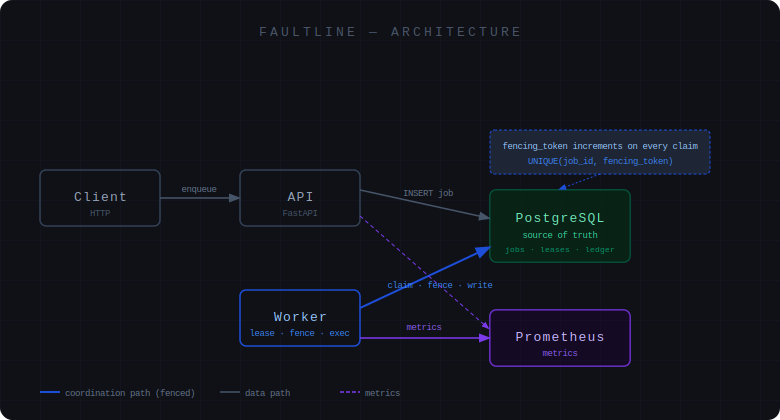

# Faultline

**Crash-safe distributed job processing using PostgreSQL lease coordination and fencing tokens.**

Faultline is a PostgreSQL-backed job queue designed around one question: what happens when a worker crashes mid-execution, a second worker reclaims the job, and the first worker comes back?

Most job queues don't have a good answer. Faultline does.

---

## Metrics dashboard

`faultline_jobs_succeeded_total` scraped from `worker:8000` — step function shows scenario runner bursts across the session.


## The Failure It's Built to Handle

Worker A claims a job. Its lease expires while it's still running (slow work, network pause, preemption). Worker B reclaims the job and starts executing. Worker A finishes its work and attempts to commit.

Without coordination, both workers write. One job executes twice.

Here's what Faultline does instead:

```
{"event":"lease_acquired",    "job_id":"05bcdb10...", "token":1}
{"event":"execution_started", "job_id":"05bcdb10...", "token":1}
{"event":"lease_acquired",    "job_id":"05bcdb10...", "token":2}   ← Worker B reclaims
{"event":"execution_started", "job_id":"05bcdb10...", "token":2}
{"event":"stale_write_blocked","stale_token":1,"current_token":2,"reason":"token_mismatch"}
{"event":"worker_exit",       "reason":"stale"}                    ← Worker A aborts
{"event":"worker_exit",       "reason":"success"}                  ← Worker B commits
```

One ledger entry. One `succeeded` state. Zero duplicate executions.

---

## Architecture



Faultline uses PostgreSQL as the coordination layer and single source of truth. Workers atomically claim jobs by acquiring time-bound leases on job rows. Each successful lease acquisition increments a monotonically increasing `fencing_token`. If a worker crashes, the lease expires and another worker safely recovers the job. If the first worker comes back, it is rejected at the database boundary.

---

## How It Works

### Lease-based claiming with `FOR UPDATE SKIP LOCKED`

Workers claim jobs atomically. If a row is already locked by another worker, it's skipped — no blocking, no thundering herd.

```sql
SELECT id FROM jobs
WHERE state = 'queued'
  AND next_run_at <= NOW()
ORDER BY next_run_at
LIMIT 1
FOR UPDATE SKIP LOCKED;
```

### Fencing tokens prevent stale writes

Every claim increments a monotonic counter on the job row:

```sql
UPDATE jobs
SET lease_owner    = %(worker_id)s,
    lease_expires_at = %(lease_until)s,
    fencing_token  = fencing_token + 1,
    state          = 'running'
WHERE id = %(job_id)s
  AND (state = 'queued'
       OR (state = 'running' AND lease_expires_at < NOW()))
RETURNING fencing_token;
```

The worker receives its token in the same round-trip that claims the job. Before every critical write, it validates:

```python
def assert_fence(cur, job_id, token):
    cur.execute("""
        SELECT fencing_token, lease_expires_at < NOW() AS lease_expired
        FROM jobs WHERE id = %s
    """, (job_id,))
    row = cur.fetchone()
    if row["fencing_token"] != token:
        raise StaleLease("token_mismatch")
    if row["lease_expired"]:
        raise StaleLease("lease_expired")
```

If the token has been superseded, the stale worker raises and exits without committing.

### Database-enforced idempotency

Even if `assert_fence()` were bypassed, the database rejects duplicate writes:

```sql
UNIQUE(job_id, fencing_token)
```

A stale worker with token=1 cannot insert a ledger entry when token=2 already exists. Two layers of protection at different points in the stack.

---

## Invariants

These must hold at all times:

| Invariant | Mechanism |
|-----------|-----------|
| No duplicate ledger entries for the same `(job_id, fencing_token)` | `UNIQUE` constraint |
| A `succeeded` job has exactly one ledger entry | `UNIQUE` constraint + state machine |
| A stale token cannot produce a successful state transition | `assert_fence()` + constraint |
| Crashed jobs converge to a correct terminal state | Reconciliation worker scans `running` jobs with expired leases and requeues them |

---

## Deterministic Failure Testing

The test harness in `tests/test_lease_race_fencing.py` forces the race condition every time — not probabilistically, but through deterministic orchestration:

1. Worker A claims the job and opens a database barrier
2. Worker B waits on the barrier (guaranteeing A claims first)
3. Worker A sleeps 2.5s with a 1s TTL — its lease expires
4. Worker B waits for expiry, reclaims, executes, succeeds
5. Worker A wakes, calls `assert_fence()`, finds token mismatch, exits

Post-run assertions:
```python
assert count == 1           # exactly one ledger entry
assert min_tok == max_tok   # no split-brain
assert int(min_tok) >= 2    # reclaim cycle actually occurred
assert state == "succeeded" # correct terminal state
```

The `>= 2` token check is important — it proves the test exercised a reclaim, not a clean first-claim success.

---

## Supported Failure Scenarios

| Scenario | Behavior |
|----------|----------|
| Worker crash during execution | Lease expires, job requeued, recovered by next worker |
| Stale worker attempts write after losing lease | Blocked by `assert_fence()` and `UNIQUE` constraint |
| Duplicate job submission | Rejected by idempotency key |
| Worker crash mid-apply (partial write) | Reconciliation worker converges to correct state |
| Database restart | Jobs in `running` state with expired leases are recovered |

---

## Known Limitations

**Clock skew in lease computation.** Lease expiry is written using the worker's local clock but checked using database time (`NOW()`). Worker clock skew can produce leases that are longer or shorter than intended. The correct fix is computing expiry entirely in the database: `lease_expires_at = NOW() + INTERVAL '5 seconds'`.

**No lease heartbeating.** Long-running jobs must either use a large TTL (slower crash recovery) or risk false failover. A heartbeat loop extending `lease_expires_at` during execution would solve this.

**At-least-once, not exactly-once.** Faultline enforces correctness at the database boundary. External side effects (API calls, emails) must be independently idempotent — the fence cannot protect them.

---

## Observability

Prometheus metrics exposed for both API and worker processes:

- Job throughput and execution latency
- Lease acquisitions, expirations, and recovery events
- Stale-write rejections (surfaced as a named metric)
- Retry counts, failure rates, queue depth

Failure modes are measurable and visible, not hidden inside retries.

---

## Stack

- Python
- PostgreSQL
- Docker
- Prometheus

---

## Quickstart

```bash
docker compose up -d --build
make migrate
curl http://localhost:8000/health
```

Run the failure drills:
```bash
make lease-race        # deterministic two-worker race
make lease-race-log    # same, with structured log output
```

---

## Why PostgreSQL and Not a Message Queue

The fencing token is bound to the same row as the job state, enforced in a single transaction. `UNIQUE(job_id, fencing_token)` is one migration. With a message queue, enforcing this constraint requires an external store, a distributed transaction, and a separate lease mechanism. For proving the correctness model, a relational database makes the invariants visible and directly testable.
