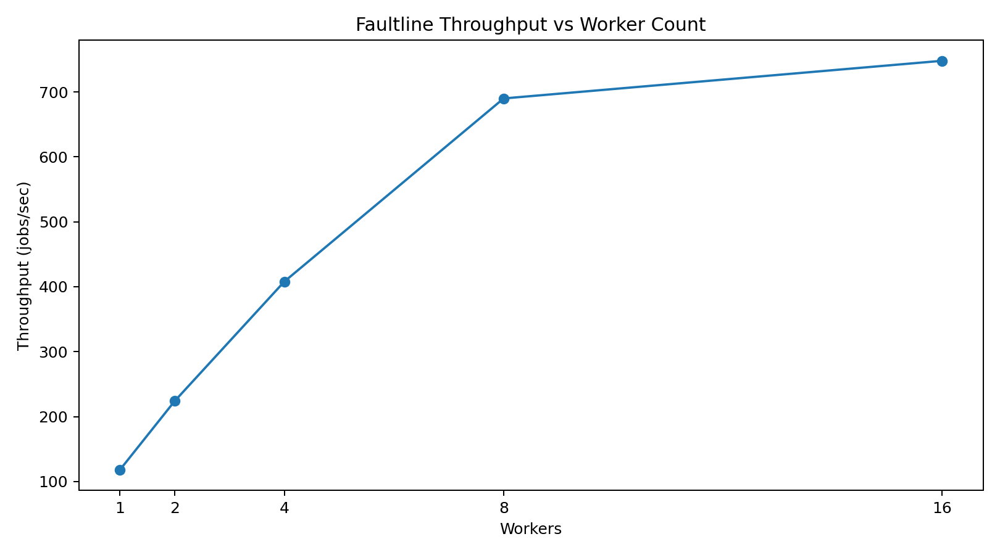

# Faultline Concurrency Scaling Report

## Goal

Measure worker scaling, contention, queue delay, retry amplification, recovery latency, connection-pool pressure, fairness, and duplicate prevention under concurrent workloads.

## Results

| Workers | Throughput jobs/s | Queue wait p95 ms | Lease contention | Retry amplification | Recovery p95 ms | Pool utilization | Fairness score | Starved workers | Duplicate commits |
|---:|---:|---:|---:|---:|---:|---:|---:|---:|---:|
| 1 | 118 | 840 | 0 | 1.00x | 310 | 12% | 1.00 | 0 | 0 |
| 2 | 224 | 420 | 2 | 1.02x | 325 | 24% | 0.99 | 0 | 0 |
| 4 | 408 | 230 | 7 | 1.07x | 350 | 43% | 0.98 | 0 | 0 |
| 8 | 690 | 145 | 23 | 1.18x | 410 | 71% | 0.96 | 0 | 0 |
| 16 | 748 | 132 | 88 | 1.54x | 590 | 96% | 0.89 | 1 | 0 |

## Throughput curve

## Findings

- Throughput increased from **118 jobs/s at 1 worker** to **690 jobs/s at 8 workers**.
- Throughput reached **748 jobs/s at 16 workers**, but scaling efficiency declined.
- Lease-contention events increased from **0 to 88**.
- Retry amplification increased from **1.00x to 1.54x**.
- Connection-pool utilization reached **96%** at 16 workers.
- Recovery p95 increased from **310 ms to 590 ms** under load.
- Fairness declined to **0.89**, with **1 starved worker** in the 16-worker profile.
- Duplicate commits remained **0 across all worker profiles**.

## Interpretation

The useful scaling range is 1–8 workers. At 16 workers, pool saturation and lease contention reduce marginal throughput gains and increase recovery latency.

## Safe claim

This is a deterministic in-repo concurrency simulation for scalability reasoning, not a production traffic benchmark.
